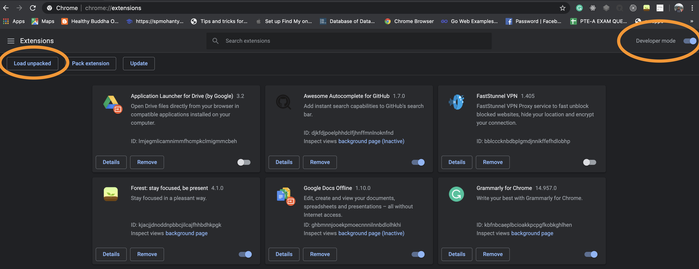

## How to install Chrome extensions manually

- Step-1: Copy **mixpanel-tools.zip** [file](./mixpanel-tools.zip) and extract into a folder. Go to chrome://extensions/ and check the box for **Developer mode** in the top right.

- Step-2: Click the **Load unpacked extension** button and select the unzipped folder for your extension to install it.

Refer the screenshot :

